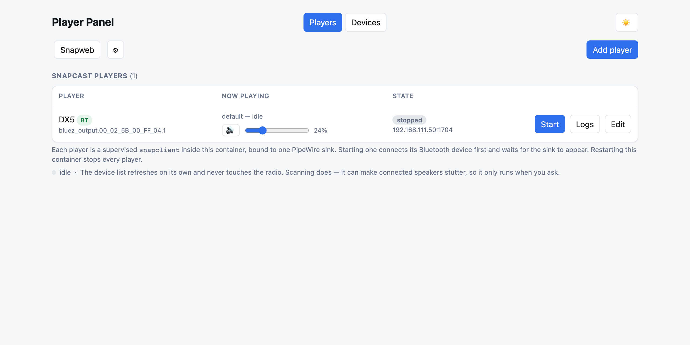
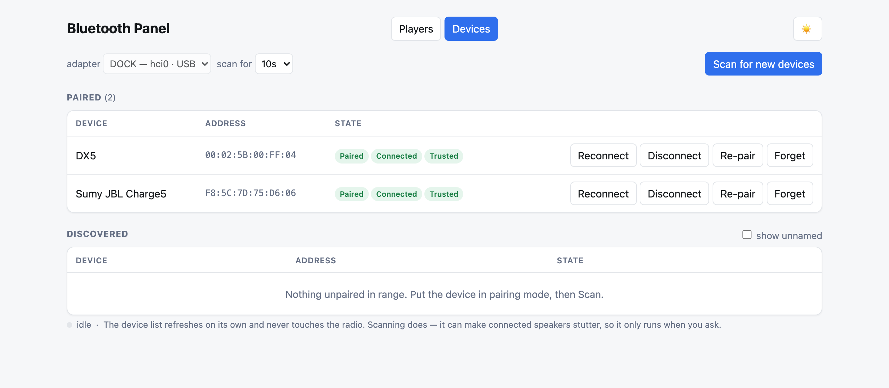
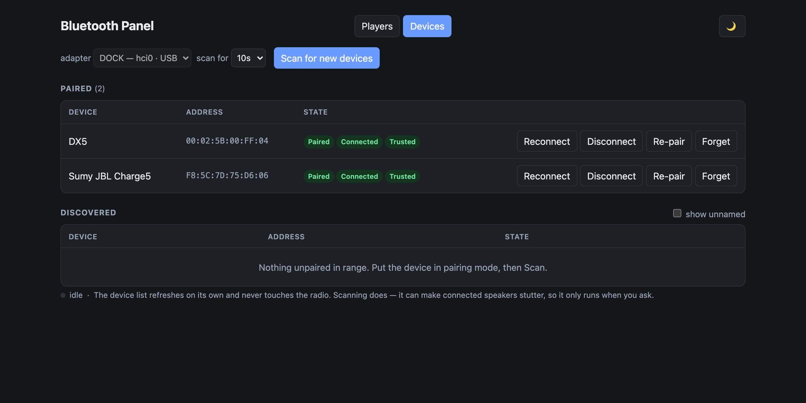
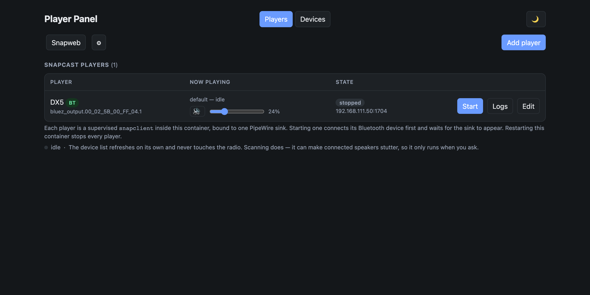

<h1 align="center">bluetooth-web-snapclient</h1>

<p align="center">
  Pair a Bluetooth speaker from your browser — then run a synced
  <a href="https://github.com/badaix/snapcast">Snapcast</a> player on it.
  <br>No SSH, no <code>bluetoothctl</code>, no copying <code>bluez_output.*</code> node names into a compose file.
</p>

<p align="center">
  <a href="https://github.com/shuricksumy/bluetooth-web-snapclient/actions/workflows/build.yml">
    
  </a>
  
  
  <a href="LICENSE"></a>
</p>

<p align="center">
  
</p>

---

## What it does

Two tabs, one container:

| | |
| :-- | :-- |
| **Players** | Create, start, stop and supervise `snapclient` processes bound to a sink. Shows what is playing — title, artist, album art — with play / pause / next / previous and per-player volume. |
| **Devices** | Scan, pair, trust, reconnect, re-pair and forget Bluetooth devices on the host. Pick between adapters (`hci0`, `hci1`, …). |

The point of putting them together: a `bluez_output` sink only exists while its
speaker is connected. Starting a player **connects its Bluetooth device first**,
waits for the sink, and if the speaker later drops off the player recovers by
itself.

<table>
<tr>
<td width="50%"></td>
<td width="50%"></td>
</tr>
<tr>
<td align="center"><em>Devices — light</em></td>
<td align="center"><em>Devices — dark</em></td>
</tr>
<tr>
<td width="50%"></td>
<td width="50%"></td>
</tr>
<tr>
<td align="center"><em>Players — light</em></td>
<td align="center"><em>Players — dark</em></td>
</tr>
</table>

Light, dark or follow-the-system, switchable in the corner and remembered.

## Highlights

- **The node name is derived for you.** A paired speaker's sink is
  `bluez_output.<MAC with underscores>.1`, prefilled when you add a player.
- **Self-healing.** `snapclient` does *not* exit when its sink disappears — it sits
  there silently — so a watchdog restarts the player and reconnects the device.
- **Honest failure.** No adapter, no `bluetoothd`, no D-Bus socket or an AppArmor
  denial each produce a specific message, not a spinner.
- **Cheap polling.** The device list costs four D-Bus property reads and never
  touches the radio. Scanning does, so it only runs when you ask.
- **No build step, no pip.** Vanilla JS in one static page; Flask, pexpect and
  snapclient all come from distro packages.
- **Multi-arch, rebuilt weekly** for `linux/amd64` and `linux/arm64`, scanned with
  Trivy on every push.
- **Optional HTTP Basic Auth** via `ADMIN_PASSWORD`.

## 🚀 Quick start

```yaml
services:
  bluetooth-web:
    image: ghcr.io/shuricksumy/bluetooth-web-snapclient:latest
    container_name: bluetooth-web
    ports:
      - "8088:8080"

    # Ubuntu and any AppArmor host — see "AppArmor" below. Not needed on Debian.
    security_opt:
      - apparmor=unconfined

    volumes:
      - /run/dbus/system_bus_socket:/run/dbus/system_bus_socket   # Bluetooth
      - /run/user/1000/pipewire-0:/tmp/pipewire-0                 # players
      - /dev/shm:/dev/shm                                         # players
      - ./bluetooth-web-config:/config                            # players.json

    environment:
      - ADMIN_PASSWORD=changeme        # empty or unset disables auth
      - SNAPSERVER_HOST=192.168.1.50   # optional; also editable in the web UI

    restart: unless-stopped
```

Then open `http://<host>:8088`. Ready-made files:
[`docker-compose-example.yaml`](docker-compose-example.yaml) (published image),
[`docker-compose.yml`](docker-compose.yml) (local build).

> Only pairing devices, not running players? Drop the last three volumes.

### Host requirements

BlueZ **5.65+** must be running on the host — this container only talks to it:

```bash
sudo apt-get install -y bluetooth bluez bluez-tools
sudo systemctl enable --now bluetooth
bluetoothctl show          # must print a controller
```

For players, the host also needs a working PipeWire session; see
[pipewire-snapclient](https://github.com/shuricksumy/pipewire-snapclient) for that
setup. Check the socket path matches your uid: `ls /run/user/$(id -u)/pipewire-0`.

### ⚠️ AppArmor hosts (Ubuntu)

On Ubuntu the socket mount is **not enough**. Docker confines containers with the
`docker-default` profile, which grants no D-Bus rules, so the kernel denies the
container's very first message:

```
An AppArmor policy prevents this sender from sending this message to this
recipient; member="Hello" destination="org.freedesktop.DBus"
```

`bluetoothctl` 5.82 does not check the resulting NULL connection and **dumps core**
rather than printing anything useful — the panel detects this case and says so.
The fix is `security_opt: [apparmor=unconfined]`, which drops only that profile:
seccomp, capabilities and namespaces stay, and the container still has nothing but
its sockets. Check whether it applies to you:

```bash
cat /sys/module/apparmor/parameters/enabled     # Y = enforcing
```

## 🏠 Home Assistant

The panel runs where the Bluetooth adapter and PipeWire session are, which is
rarely the Home Assistant box — so it has no place in the sidebar, because
Ingress only serves add-ons. A companion add-on proxies it in:

[](https://my.home-assistant.io/redirect/supervisor_add_addon_repository/?repository_url=https%3A%2F%2Fgithub.com%2Fshuricksumy%2Fhome-assistant-apps)
[](https://my.home-assistant.io/redirect/supervisor_addon/?addon=bluetooth_web_proxy&repository_url=https%3A%2F%2Fgithub.com%2Fshuricksumy%2Fhome-assistant-apps)

Add the repository with the first button, open the add-on with the second, set
`server_host` / `server_port` (and the panel's `username` / `password` if you set
one), start it and tick *Show in sidebar*. Home Assistant's own login sits in
front, and it works through Nabu Casa like any other add-on.

Source: [bluetooth_web_proxy](https://github.com/shuricksumy/home-assistant-apps/tree/main/bluetooth_web_proxy).

## 🔊 Players

Pair a speaker on **Devices**, then **Players → Add player**. Choosing the device
fills in the rest:

| Field | Default |
| :-- | :-- |
| Output | the paired device — decides `PIPEWIRE_NODE` |
| Name | the device name plus a marker, e.g. `JBL Charge 5 (BT)` — template editable under ⚙ |
| Snapserver | from settings, else the host you are browsing |
| Latency (ms) | `0` — **see below** |
| PipeWire buffer | `1024/48000` for Bluetooth, `2048/192000` otherwise |
| ALSA bridge | on — copes with a sink changing sample rate under it |

### ⚠️ Bluetooth latency

A2DP adds roughly **150–250 ms**. Against wired rooms a Bluetooth speaker will be
audibly late until you compensate, so set a **negative** *Latency (ms)* — start
near `-180` and tune by ear. This is the most likely reason a new BT player sounds
wrong, and it is not a bug.

### What this costs you

Players are children of this container, so **restarting the panel stops every
player**. If you need audio that survives a panel restart, run those players as
separate [pipewire-snapclient](https://github.com/shuricksumy/pipewire-snapclient)
containers — this panel leaves containers it did not create alone.

## ⚙️ Configuration

Everything under **⚙** in the UI is stored in `/config` and wins over the
environment; the environment only seeds the defaults.

| Variable | Default | Description |
| :-- | :-- | :-- |
| `ADMIN_PASSWORD` | _(empty)_ | Enables HTTP Basic Auth on every route. Empty = no auth. |
| `ADMIN_USER` | `admin` | Username for Basic Auth. |
| `SNAPSERVER_HOST` | _(empty)_ | Default Snapserver for new players. Empty = the host you browsed. |
| `SNAPSERVER_PORT` | `1704` | Audio port. |
| `SNAPSERVER_CONTROL_PORT` | `1705` | JSON-RPC: now playing, transport, client naming. |
| `SNAPSERVER_WEB_PORT` | `1780` | Snapweb, linked from the toolbar. |
| `POLL_SECONDS` | `5` | How often the browser re-reads state. |
| `CONFIG_DIR` | `/config` | Where `players.json` lives. |
| `PORT` / `BIND_HOST` | `8080` / `0.0.0.0` | Listener inside the container. |
| `DEBUG` | `false` | `true` raises the log level. |

## 🔒 Security

**It runs as root.** BlueZ's D-Bus policy grants `Pair`/`Trust`/`Remove` to uid 0,
and on some distributions to a `bluetooth`/`lp` group whose gid differs per host —
brittle to match from a container. It is still unprivileged in the Docker sense:
no extra capabilities, no device nodes, no host namespaces.

**Auth is off by default.** Unset `ADMIN_PASSWORD` means anyone who can reach the
port can unpair your speakers. Set it, keep this on a trusted LAN, and put TLS in
front if it goes anywhere else.

MAC addresses from the browser are checked with `fullmatch` against
`^[0-9A-Fa-f]{2}(:[0-9A-Fa-f]{2}){5}$` before reaching `bluetoothctl`'s stdin —
the backend drives one REPL that takes a command per line, so a MAC carrying a
newline would append commands to the session. (`re.match` would not do: `$` also
matches before a trailing newline.)

## 🧩 API

Every route returns JSON. `<mac>` must match the pattern above or you get a `400`.

| Method | Route | Description |
| :-- | :-- | :-- |
| `GET` | `/api/devices` | The device table. |
| `POST` | `/api/scan` | `scan on`, wait, `scan off`. Body `{"duration": 10}`, capped at 60s. |
| `POST` | `/api/pair/<mac>` | Pair → trust → connect. |
| `POST` | `/api/reconnect/<mac>` | Disconnect then connect. |
| `POST` | `/api/repair/<mac>` | Forget, rediscover, pair again. |
| `POST` | `/api/{connect,disconnect,trust,remove}/<mac>` | The individual steps. |
| `GET` | `/api/adapters` · `POST /api/adapter/<mac>` | List and select controllers. |
| `GET` | `/api/players` · `POST /api/players` | List and create players. |
| `PATCH`/`DELETE` | `/api/players/<id>` | Update (restarts a running player) / remove. |
| `POST` | `/api/players/<id>/{start,stop,restart}` | Lifecycle. |
| `POST` | `/api/players/<id>/control/{play,pause,next,previous}` | Transport, where the stream allows it. |
| `POST` | `/api/players/<id>/volume` | `{"percent":50}` or `{"muted":true}`. |
| `GET` | `/api/players/<id>/logs` | Last 200 lines. |
| `GET` | `/api/sinks` | PipeWire sinks available now. |
| `GET`/`PATCH` | `/api/settings` | Panel settings. |
| `GET` | `/api/snapcast/stale` · `DELETE /api/snapcast/client/<id>` | Forget clients nothing uses. |

Status codes: `400` bad input · `401` auth required · `409` REPL busy or stream
cannot be controlled · `502` BlueZ/Snapcast refused · `503` no controller, no
bluetoothd, or the bus is unreachable.

## 🏗️ Development

```bash
pip install flask pexpect pytest
python -m pytest tests/ -v      # ~170 tests, no adapter or D-Bus needed

# Run against fakes instead of real hardware
BLUETOOTHCTL="python3 tests/mock_bluetoothctl.py" python3 app.py
# MOCK_MODE=nocontroller|exits|hangs|oldbluez exercises the degraded paths

docker build -t bluetooth-web-snapclient .
```

| File | Role |
| :-- | :-- |
| [`app.py`](app.py) | Flask routes, MAC validation, auth, stale-cache fallback |
| [`btctl.py`](btctl.py) | The long-lived `bluetoothctl` REPL and its parsing |
| [`players.py`](players.py) | Supervised `snapclient` children: launch, watchdog, backoff, persistence |
| [`snapctl.py`](snapctl.py) | Snapserver JSON-RPC: now playing, transport, volume, naming |
| [`static/index.html`](static/index.html) | The whole frontend — vanilla JS, no build step |
| [`tests/`](tests/) | pytest suite plus fake `bluetoothctl`, `snapclient` and Snapserver |

### Why drive a REPL instead of speaking D-Bus directly?

Pairing needs a registered BlueZ *agent*. `bluetoothctl agent NoInputNoOutput`
provides one in a line; doing it over raw D-Bus means exporting an
`org.bluez.Agent1` object and handling `RequestConfirmation` and friends — a lot
of surface for a panel whose job is "click pair". The cost is parsing a terminal
UI, which [`btctl.py`](btctl.py) is careful about: it strips ANSI, ignores async
`[NEW]`/`[CHG]` notifications, drains the buffer before each command, and accepts
both the BlueZ 5.7x `#` prompt and the 5.8x `>` one.

## License

MIT — see [LICENSE](LICENSE).
